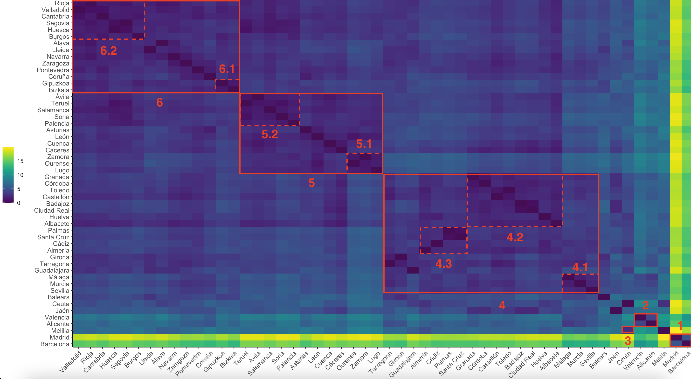
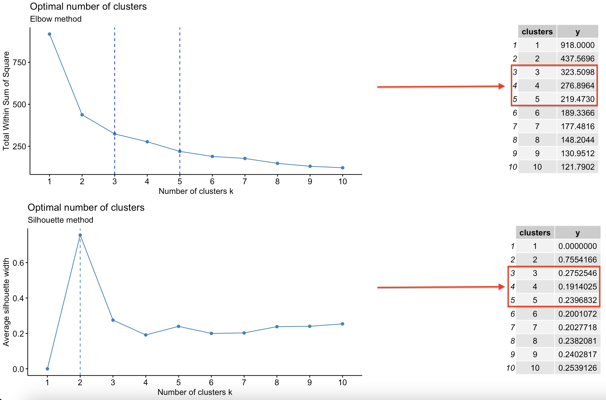
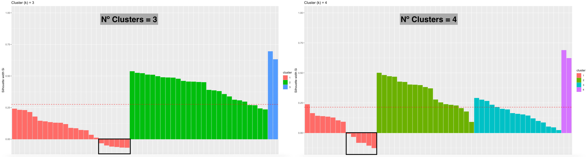
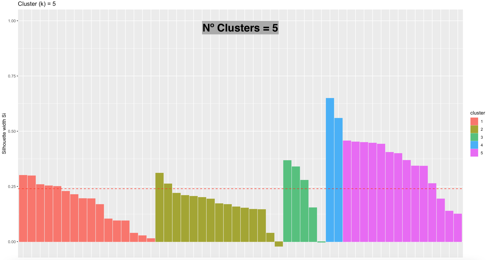

<style>
body {
text-align: justify}
</style>

```{r setup, include=FALSE}
knitr::opts_chunk$set(echo = TRUE)
```

```{r, echo = FALSE, include = FALSE}
library(readxl)
library(knitr)
library(RColorBrewer)
library(pastecs)
library(ggplot2) 
library(corrplot)
library(factoextra) 
library(FactoMineR)
library(gridExtra)
library(dplyr)
```

## PARTE 1. ANÁLISIS DE COMPONENTES PRINCIPALES
### Apartado 1
__Calcular la matriz de correlaciones, y su representación gráfica ¿Cuáles son las variables más correlacionadas de forma inversa?__

De forma previa a la matriz de correlación, debemos cargar el conjunto de datos, además de renombrar los nombres de fila empleando los nombres de provincia:

```{r}
provincias <- as.data.frame(read_excel("Provincias.xlsx"))
rownames(provincias) <- provincias$Provincia; provincias <- provincias[, -1] # Eliminamos finalmente la columna "Provincia"
```

Una vez cargado el conjunto de datos, calculamos la matriz de correlación:

```{r}
matriz.correlaciones <-cor(provincias)
```

__PRIMERAS 9 COLUMNAS__

```{r, echo=FALSE}
library(formattable)
formattable(as.data.frame(matriz.correlaciones[, c(1:9)]), list(
  area(row = 2, col = 3) ~ color_tile("#FFCCCB", "#FFCCCB")
))
```

__ÚLTIMAS 9 COLUMNAS__

```{r, echo=FALSE}
formattable(as.data.frame(matriz.correlaciones[, c(10:18)]), list(
  area(row = 2, col = 3) ~ color_tile("#FFCCCB", "#FFCCCB"),
  area(row = 2, col = 4) ~ color_tile("#FFCCCB", "#FFCCCB"),
  area(row = 4, col = 4) ~ color_tile("#FFCCCB", "#FFCCCB")
))
```

Así como su representación gráfica:

```{r}
corrplot(matriz.correlaciones, type="upper", col=brewer.pal(n=8, name="RdYlBu"))
```

Analizando la gráfica de correlación, de forma inversa nos encontramos con múltiples variables aunque la mayoría de ellas con valores muy cercanos a 0. No obstante, si debemos destacar los siguientes casos:

1. __MORTALIDAD - NATALIDAD__: presenta una elevada correlación negativa (-0.74). Es decir, aquellas provincias donde es mayor la tasa de natalidad, la tasa de mortalidad se reduce.

2. __MORTALIDAD - TASA_ACTIVIDAD__: con una correlación muy similar a la anterior (-0.73), esto es, a medida que aumenta la tasa de mortalidad en una provincia, el porcentaje de personas en "edad laboral" disminuye.

3. __MORTALIDAD - TASA_PARO__: con una correlación bastante menor a las dos anteriores, aunque también significativa (-0.46): en provincias donde la tasa de mortalidad es elevada, el número de parados es menor (y viceversa).

En relación con la mortalidad, __podemos decir que a medida que aumenta la mortalidad en la provincia, disminuyen las tasas de natalidad, de actividad, e incluso la tasa de desempleo__ (y viceversa).

4. __IPC - TASA_PARO__: una correlación inferior a -0.5, por lo que también es significativa (-0.58): __a medida que aumenta el índice de precios al consumidor, la tasa de paro se reduce__. Dicho de otro modo, en aquellas provincias donde el coste de vida es mayor, la tasa de desempleo, por lo general, parece ser menor.

Aunque no se trata de una correlación negativa, quisiera destacar la correlación existente entre _NumEmpresas_, _Industria_, _Construccion_, _CTH_, _Infor_, _AFS_ y _APT_, así como la tasa de ocupados, el _PIB_ y el número de viviendas familiares, __con correlaciones muy cercanas a 1 entre sí__. Por tanto, provincias con un elevado número de empresas no sólo tendran un mayor número de empresas en cada sector (industria, construcción, comercio, hostelería, finanzas y actividades profesionales), sino además una mayor tasa de empleo, mayor PIB y un elevado número de viviendas familiares.

### Apartado 2
__Realizar un análisis de componentes principales sobre la matriz de correlaciones, calculando 7 componentes. Estudiar los valores de los autovalores obtenidos y las gráficas que los resumen. ¿Cuál es el número adecuado de componentes?__

Con los datos de provincias, realizamos el análisis con un total de siete componentes, tal y como se muestra a continuación:

```{r}
# Obtenemos los autovalores
analisis.comp <- PCA(provincias, scale.unit = TRUE, ncp = 7, graph = FALSE)
```
```{r, echo=FALSE}
formattable(round(as.data.frame(analisis.comp$eig), 2), list(
  area(row = 1) ~ color_tile("#458B00", "#458B00"),
  area(row = 2) ~ color_tile("#78AB46", "#78AB46"),
  area(row = 3) ~ color_tile("#66CD00", "#66CD00"),
  area(row = 4) ~ color_tile("#BCED91", "#BCED91")
))
```

Analizando la tabla anterior, podemos observar como con 7 componentes __se explica aproximadamente el 98.74 % de la variabilidad de los datos__. No obstante, ¿Es el número adecuado de componentes? Para responder a esta pregunta debemos fijarnos no solo en el porcentaje acumulado de la varianza, sino además en los __autovalores__. Entre la primera y la tercera componente nos encontramos con autovalores superiores a 1 (11.47, 2.56 y 1.63, respectivamente). Dado que la suma de los autovalores coincide con el número de variables del fichero, observamos que la componente 1 ya es capaz de explicar cerca del 63.70 % de la variabilidad total del conjunto de datos estandarizado, aproximadamente 11 de las 18 variables. Si a lo anterior le añadimos los autovalores de la segunda y tercera componente, logramos explicar cerca del 90 % de la variabilidad (cerca de 16 variables). En adelante, la variabilidad total apenas aumenta hasta la componente 7, cuyo autovalor es de 0.31, es decir, no llega a explicar ni siquiera una variable. 

A primera vista, la opción adecuada sería elegir 3 componentes, dado que sus autovalores son superiores a 1. No obstante, analicemos el siguiente gráfico:

```{r}
# Representamos graficamente la proporcion de varianza explicada por cada Componente Principal
fviz_eig(analisis.comp,addlabels=TRUE)
```

En función de la proporción de varianza, la componente 4 también parece aportar un porcentaje significativo con respecto a las siguientes componentes (5.2 %). De hecho, aunque su autovalor no sea 1, es muy cercano (0.93), llegando a explicar __casi__ una variable. Por tanto, dado que a partir de la componente 5 la variabilidad explicada comienza a disminuir por debajo del 5 %, además de que con 4 componentes logramos explicar más del 90 % de la variabilidad, minimizamos la pérdida de información, por lo que __elegimos 4 como número adecuado de componentes__.

### Apartado 3
__Hacer de nuevo el análisis sobre la matriz de correlaciones pero ahora indicando el número de componentes principales que hemos decidido retener (Que expliquen aproximadamente el 90%). Sobre este análisis contestar los siguientes apartados.__

```{r}
# Ahora con 4 componentes
analisis.comp <- PCA(provincias, scale.unit = TRUE, ncp = 4, graph = FALSE)
```

#### Apartado a)
__Mostrar los coeficientes para obtener las componentes principales ¿Cuál es la expresión para calcular la primera Componente en función de las variables originales?__

En primer lugar, mostramos los coeficientes necesarios para el cálculo de la componente, esto es, __los autovectores__:

```{r}
autovectores.pc1 <- t(analisis.comp$svd$V[,1])
colnames(autovectores.pc1) <- colnames(provincias)
knitr::kable(autovectores.pc1, digits =2,caption = "Autovectores de la primera componente")
```

Por tanto, para calcular la primera Componente basta con realizar la combinación lineal de los autovectores:

$$
CP_1 = 0.29Poblacion^* - 0.11Mortalidad^* + 0.04Natalidad^* + 0.11IPC^* + 0.29NumEmpresas^* + 0.29Industria^* + 0.29Construccion^* + 0.29CTH^* +
$$
$$
+ 0.28Infor^* + 0.29AFS^* + 0.29APT^* + 0.11TasaActividad^* - 0.01TasaParo^* + 0.29Ocupados^* + 0.29PIB^* + 0.02CANE^* + 0.29TVF^* + 0.17VS^*
$$

Donde "*" indican que las variables deben estar __estandarizadas__. Como podemos observar, nos encontramos con autovectores negativos en la primera componente, de los cuales la tasa de Mortalidad es la más influyente. Por el contrario, variables como la tasa de Natalidad, la tasa de paro o el CANE apenas influyen en el valor de la componente, con coeficientes muy cercanos a 0 (parece tratarse de un índice principalmente económico más que demográfico).

#### Apartado b)
__Mostar una tabla con las correlaciones de las Variables con las Componentes Principales. Para cada Componente indicar las variables con las que está más correlacionada__

```{r}
var<-get_pca_var(analisis.comp)
```
```{r, echo=FALSE}
formattable(round(as.data.frame(var$cor), 3), list(
  area(row = c(1,5,6,7,8,9,10,11,14,15,17,18), col = 1) ~ color_tile("#0EBFE9", "#0EBFE9"),
  area(row = c(2,3,4,12,13), col = 2) ~ color_tile("#0EBFE9", "#0EBFE9"),
  area(row = c(16), col = 3) ~ color_tile("#0EBFE9", "#0EBFE9")
))
```

Analizando la tabla de correlaciones, destacamos las variables con las que más está correlacionada cada componente:

1. __COMPONENTE 1__: destaca la elevada correlación positiva con los campos _Poblacion_, _NumEmpresas_, _Industria_, _Construccion_, _CTH_, _Infor_, _AFS_, _APT_ (tanto el total de empresas como el número de empresas de cada sector se concentran en torno a la misma componente), _Ocupados_, el _PIB_, el total de viviendas familiares o _TVF_ y _VS_ o viviendas secundarias. Todas ellas estan correlacionadas de forma directa. Por tanto, __valores positivos de la COMPONENTE 1 se traducen en una provincia con altos niveles de población, número de empresas, tasa de ocupación, PIB y número de viviendas__ (tanto principales como de segunda residencia).

Por otro lado, nos encontramos con correlaciones menos significativas pero que también debemos tener en cuenta: correlaciones positivas con el IPC y la tasa de Actividad, aunque más bajas (0.37~0.38). Lo mismo, aunque en sentido negativo, ocurre con la Mortalidad. 

2. __COMPONENTE 2__: destaca la correlación negativa entre _Mortalidad_ e _IPC_, junto con una correlación positiva con los campos _Natalidad_, _TasaActividad_ y _TasaParo_, principalmente. Por tanto, __valores positivos de la COMPONENTE 2 implican provincias con altos niveles de natalidad, tasa de actividad y de paro, aunque con una menor tasa de mortalidad y poder adquisitivo de las familias (IPC bajo)__. Del mismo modo, valores negativos de la COMPONENTE 2 se traducen en provincias donde la tasa de mortalidad y el poder adquisitivo de las familias es mayor (IPC alto), aunque con una menor tasa de natalidad, de actividad laboral y paro.

3. __COMPONENTE 3__: destaca la variable CANE con mayor correlación (positiva). Por otro lado, de cara la interpretación de las variables debemos tener en cuenta también correlaciones positivas (aunque menos significativas) con las tasas de paro y el número de viviendas secundarias (0.495 y 0.371), así como negativas con los valores de natalidad, IPC y tasa de actividad (-0.346, -0.335 y -0.464).

No obstante, ¿qué ocurre con la componente 4? Como podemos observar, pese a que el valor máximo de correlación corresponde con el campo _VS_, dicha variable presenta una mayor correlación con la primera componente (0.584 frente a 0.548). Por tanto, podemos asegurar que la cuarta componente __no llega a representar exclusivamente a ninguna de las variables del conjunto de datos__, pese a lograr explicar una variabilidad del 92 % tal y como vimos en el apartado anterior. Como conclusión, __definitivamente realizaremos el análisis sobre la matriz de correlación empleando tan solo las tres primeras componentes__:

```{r, results='hide'}
analisis.comp<-PCA(provincias,scale.unit=TRUE, ncp=3, graph=FALSE)
var<-get_pca_var(analisis.comp)
```

#### Apartado c)
__Comentar los gráficos que representan las variables en los planos formados por las componentes, intentando explicar lo que representa cada componente__

Inicialmente, comenzamos representando el gráfico de correlación entre las componentes 1 y 2:

```{r}
fviz_pca_var(analisis.comp, axes = c(1, 2), col.var="cos2",gradient.cols = c("#00AFBB", "#E7B800", "#FC4E07"), repel = TRUE)
```


Como primer análisis, podemos observar cómo las variables que estaban correlacionadas positivamente entre sí (tal y como comprobamos en el gráfico de correlación),  presentan prácticamente las mismas direcciones (Población, Ocupados o NumEmpresas, entre otros). Por el contrario, variables correlacionadas negativamente se sitúan en posiciones opuestas (cuadrantes opuestos), como por ejemplo la Natalidad y la Tasa de Actividad con la Mortalidad, o la Tasa de Paro y el IPC. A continuación, relacionamos cada componente con el conjunto de variables más representativo:

1. __COMPONENTE 1__: __podemos asegurar que la componente 1 es un índice que recoge principalmente la actividad económica de la provincia (número de empresas + PIB + tasa de ocupación)__, aunque también incluye información demográfica como la población total o el número de viviendas (aunque el número de viviendas secundarias en menor medida).

2. __COMPONENTE 2__: __corresponde con un índice principalmente demográfico__, contrastando especialmente los valores de Natalidad y Mortalidad de la Provincia, aunque también incluye información económica de la región como la proporción de población activa, nivel de desempleo y variación de los precios (aunque con menor correlación).

A continuación, analizamos la tercera componente:

```{r}
fviz_pca_var(analisis.comp, axes = c(1, 3), col.var="cos2",gradient.cols = c("#00AFBB", "#E7B800", "#FC4E07"), repel = TRUE)
```

3. __COMPONENTE 3__: __representa principalmente al Censo Agrario del Número de Explotaciones (CANE)__, con el que mantiene una elevada correlación positiva.

#### Apartado d)
__Mostrar la tabla y los gráficos que nos muestran la proporción de la varianza de cada variable que es explicado por cada componente. ¿Cuál de las variables es la que está peor explicada?__

En primer lugar, representamos la tabla con los cosenos al cuadrado:

```{r, eval=FALSE}
knitr::kable(var$cos2, digits =2,caption = "Cosenos al cuadrado")
```
```{r, echo=FALSE}
formattable(round(as.data.frame(var$cos2), 2), list(
  area(row = c(1,5,6,7,8,9,10,11,14,15,17,18), col = 1) ~ color_tile("#0EBFE9", "#0EBFE9"),
  area(row = c(2,3,4,12,13), col = 2) ~ color_tile("#0EBFE9", "#0EBFE9"),
  area(row = c(16), col = 3) ~ color_tile("#0EBFE9", "#0EBFE9")
))
```

Para visualizar mejor los resultados, lo representamos gráficamente:

```{r}
corrplot(t(var$cos2), is.corr = FALSE, tl.srt=45)
```

Dado que los cosenos al cuadrado nos indican la proporción de varianza, de cada variable, que es explicada en cada componente, observamos que la primera es __la que mejor explica la variación de sus variables más representativas__. Aunque bien es cierto que el número de viviendas secundarias o _VS_ está peor explicada (con solo un 34 % de la varianza explicada), con el resto de variables llega a explicarse más del 90 % de la variabilidad.

En relación con la segunda componente, las variables mejor explicadas corresponden con las tasas de Mortalidad y Natalidad con un 71 y 63 % de la varianza, respectivamente. Por el contrario, están peor explicados los campos TasaParo, IPC y TasaActividad, en orden descendente (55, 34 y 28 %). De este modo, __podemos volver a comprobar como la información contenida en la primera componente es principalmente económica, mientras que la segunda contiene información demográfica__.

Por último, la componente 3 explica, principalmente, el campo CANE (con un 70 % de la varianza total), pudiendo considerarse como un índice económico adicional.

No obstante, ¿Cuál es la variable peor explicada por las componentes? 

```{r}
fviz_cos2(analisis.comp, choice = "var", axes = 1:3)
```

Comprobamos que la variable peor explicada __corresponde con el número de viviendas secundarias, dado que el porcentaje de varianza explicada, en conjunto con las tres componentes, corresponde con un 49 %__ (0.35 + 0.01 + 0.14).

#### Apartado e)
__Mostrar la tabla y los gráficos que nos muestran el porcentaje de la varianza de cada Componente que es debido a cada variable. ¿Qué variables contribuyen más a cada Componente?__

En primer lugar, mostramos la tabla con las contribuciones de cada variable a la varianza de cada componente:

```{r, eval=FALSE}
knitr::kable(var$contrib, digits = 2, caption = "Contribuciones")
```
```{r, echo=FALSE}
formattable(round(as.data.frame(var$contrib), 2), list(
  area(row = c(1,5,6,7,8,9,10,11,14,15,17,18), col = 1) ~ color_tile("#0EBFE9", "#0EBFE9"),
  area(row = c(2,3,4,12,13), col = 2) ~ color_tile("#0EBFE9", "#0EBFE9"),
  area(row = c(16), col = 3) ~ color_tile("#0EBFE9", "#0EBFE9")
))
```

Así como su representación gráfica:

```{r}
corrplot(t(var$contrib), is.corr = FALSE, tl.srt=45)
```

Analizando tanto la tabla como el gráfico, observamos que la componente 1 __presenta una varianza distribuida de forma equitativa sobre el conjunto de sus variables__, mientras que la varianza de las componentes 2 y 3 __es explicada principalmente por un pequeño subconjunto__. 

Como observamos en el siguiente gráfico, en relación con la primera componente la variable _Infor_ es la que menor porcentaje aporta a la varianza (7.92 %). El resto de variables significativas presentan una aportación superior al 8 %, distribuyéndose en torno a variables económicas:

```{r}
fviz_contrib(analisis.comp,choice="var",axes=1,top=11)
```

En relación con la segunda componente, los porcentajes de contribución se concentran mayoritariamente en torno a la información demográfica de la provincia, destacando los campos _Mortalidad_, _Natalidad_, como incluso _TasaParo_, cuyas contribuciones superan el 20 %. Por el contrario, los campos como el IPC y la Tasa de Actividad superan ligeramente el 10 % de la contribución:

```{r}
fviz_contrib(analisis.comp,choice="var",axes=2,top=5)
```

Por último, el porcentaje de contribución a la tercera componente se centra principalmente en torno a la variable _CANE_, acumulando el 43.13 % de su varianza total, siguiéndole en menor medida campos de menor correlación como la Tasa de Paro, Actividad y el número de viviendas secundarias:

```{r}
fviz_contrib(analisis.comp,choice="var",axes=3,top=4)
```

#### Apartado f)
__Sobre los gráficos que representan las observaciones en los nuevos ejes y el gráfico Biplot., teniendo en cuenta la posición de las provincias en el gráfico Comentar las provincias que tienen una posición más destacada en cada componente, en positivo o negativo, ¿Qué significa esto en términos socioeconómicos para estas provincias?__

Inicialmente, comenzamos con el gráfico con las observaciones en los nuevos ejes:

```{r, fig.height=9, fig.width=12}
fviz_pca_ind(analisis.comp, axes = c(1, 2), col.ind = "cos2",
             gradient.cols = c("#00AFBB", "#E7B800", "#FC4E07"), repel = TRUE)
```

En un primer análisis, podemos observar ciertos grupos o _clusters_ formados entre diferentes provincias. A modo de ejemplo:

1. __Las grandes ciudades como Madrid y Barcelona__, con valores positivos en la primera componente, lo que según la información que representa suponen altos niveles de población, viviendas familiares, tasa de ocupación y un elevado número de empresas; además de valores negativos en la segunda componente, esto es, mayor tasa mortalidad e IPC.
2. __Las provincias de Lugo, Ourense y Zamora__, con valores negativos en la segunda componente, es decir, altas de mortalidad e IPC, además de valores negativos en la primera componente, lo que se traduce en una menor población, número de viviendas y actividad económica.
3. __Las ciudades autónomas de Ceuta y Melilla__, ubicadas en valores positivos de la segunda componente: altas tasas de natalidad, desempleo y actividad laboral; aunque con valores negativos en la primera componente: menor población, número de viviendas y actividad económica.

Sin embargo, también podemos encontrar provincias que no destacan en ninguna de las componentes, esto es, los valores de las componentes se sitúan cerca de la media (dado que los datos están estandarizados, la media es cero). Como primera impresión, analizamos qué provincias se sitúan más cerca del centro del gráfico, a través de una intersección entre los gráficos de la Componente 1 - Componente 2 y la Componente 1 - Componente 3, filtrando aquellas provincias cuya distancia al centro del gráfico sea muy pequeña en ambos casos (a modo de ejemplo, menor a 0.5):

```{r, echo=FALSE}
observaciones.1.2 <- fviz_pca_ind(analisis.comp, axes = c(1, 2), col.ind = "cos2",
                     gradient.cols = c("#00AFBB", "#E7B800", "#FC4E07"), repel = TRUE)

observaciones.1.3 <- fviz_pca_ind(analisis.comp, axes = c(1, 3), col.ind = "cos2",
                     gradient.cols = c("#00AFBB", "#E7B800", "#FC4E07"), repel = TRUE)

observaciones.2.3 <- fviz_pca_ind(analisis.comp, axes = c(2, 3), col.ind = "cos2",
                     gradient.cols = c("#00AFBB", "#E7B800", "#FC4E07"), repel = TRUE)
```

```{r}
# ¿Que provincias no parecen destacar especialmente en ninguna de las componentes?
Reduce(intersect, 
       list(rownames(observaciones.1.2$data[(abs(observaciones.1.2$data$x) < 1 & abs(observaciones.1.2$data$y) < 1), ]),
       rownames(observaciones.1.3$data[(abs(observaciones.1.3$data$x) < 1 & abs(observaciones.1.3$data$y) < 1), ]),
       rownames(observaciones.2.3$data[(abs(observaciones.2.3$data$x) < 1 & abs(observaciones.2.3$data$y) < 1), ])))
```

Como podemos comprobar, las provincias de Castellón, Pontevedra y Zaragoza presentan valores en las componentes muy cercanos a 0, por lo que no parecen destacar en ninguna de las componentes, es decir, __su valores se sitúan en torno a la media__.

No obstante, nos resulta mucho más fácil analizar las variables empleando el biplot, ya que nos permite tener las variables originales. Comenzamos con las componentes 1 y 2:

```{r, fig.height=9, fig.width=12}
fviz_pca_biplot(analisis.comp, repel = TRUE, col.var = "#2E9FDF", col.ind = "#696969", labelsize = 3)
```

Comenzamos con las variables más relevantes de la __COMPONENTE 1__:

1. __NUM_EMPRESAS, INDUSTRIA, CONSTRUCCIÓN, INFOR, AFS, APT, POBLACION, OCUPADOS, PIB, TVF__: caben destacar grandes ciudades como __Valencia, pero en especial Barcelona y Madrid__, regiones que se caracterizan por una mayor actividad económica, lo que se traduce en un mayor número de empresas (tanto total como en cada sector); además de un mayor número de habitantes, tasa de ocupación laboral, producto interior bruto y mayor número de viviendas familiares, es decir, __son las provincias con mayor población y desarrollo económico__. Por el contrario, regiones como __Álava, Cáceres, Rioja, Cuenca y Albacete__ destacan por su menor actividad empresarial y demográfica. 

No obstante, destaca el gran contraste económico entre ambos extremos: __en sentido negativo a los vectores de la primera componente nos encontramos con mayor número de provincias que en sentido positivo__. Por tanto, a la vista de la disposición de los datos podemos asegurar que el nivel de población y de actividad empresarial en España se concentra mayoritariamente en torno a un pequeño grupo de provincias como Murcia, Sevilla, Málaga, Alicante, Madrid o Barcelona, entre otros. En relación al resto, la actividad económica es mucho menor.

2. __VS__: en relación con el número de viviendas secundarias, destacan las __Islas Baleares y especialmente Alicante__, en contraste con provincias de interior como __Cáceres, Rioja o Cuenca__, principalmente. Si nos fijamos en el _biplot_, Valencia se sitúa "a la par" entre las variables de la primera componente, es decir, no solo destaca por una elevada población o por una mayor actividad económica, sino también por un elevado número de viviendas secundarias; en contraste con Madrid o Barcelona, más alejados de la variable _VS_.

__COMPONENTE 2__:

3. __TASA_PARO, NATALIDAD__: ambas variables presentan una correlación positiva (ángulo agudo), por lo que regiones del sur como __Santa Cruz, Cádiz, Palmas, Almería, y en especial las ciudades Autónomas de Ceuta y Melilla__, no sólo se caracterizan por un mayor porcentaje de desempleo, sino además por altas tasas de natalidad. Por el contrario, provincias del norte peninsular como __Gipuzkoa, Burgos, Bizkaia, Coruña o Asturias__ presentan un menor porcentaje de paro y de natalidad. A _grosso modo_, salvo determinadas provincias como Álava, Navarra o Lleida (donde los valores de la componente 2 son más cercanos a cero), __la distribución de las provincias permite comprobar que, por lo general, las regiones del norte peninsular presentan menores tasas de paro y de natalidad, en comparación con las regiones del sur-levante__.

4. __TASA_ACTIVIDAD__: __Murcia, Málaga y Sevilla__ destacan por tasas de actividad elevadas, mientras que provincias como __Palencia, Soria y León__ presentan una menor proporción de población activa. Curiosamente, llama la atención la menor correlación que existe entre la tasa de paro y la tasa de actividad (mayor ángulo), es decir, __no por el hecho de tener una mayor tasa de desempleo implica un mayor porcentaje de población activa__. De hecho, si comparamos las provincias de Cádiz (misma dirección que la tasa de paro) y Sevilla (situada más cerca de la tasa de actividad):

```{r}
knitr::kable(cbind(get_pca_ind(analisis.comp)$coord[c("Cádiz", "Sevilla"), c(1,2)],provincias[c("Cádiz", "Sevilla"),c("TasaParo", "TasaActividad")]), digits = 2, caption = "Contribuciones")
```

En el caso de Cádiz, hay una mayor tasa de paro, mientras que en Sevilla existe una mayor tasa de Actividad, pese a tener un valor prácticamente idéntico en la segunda componente. Sin embargo, el valor de la componente 1 es superior en el caso de Sevilla, dado que el valor del autovector _TasaActividad_ es superior al de la _TasaParo_ como pudimos comprobar en el apartado a). Esto último implica que Sevilla (al tener una mayor tasa de actividad) presenta un mayor valor de la Componente 1. Por tanto, __de todas las provincias con altas tasas de paro, Murcia, Sevilla y Málaga son las regiones donde más población se encuentra en activo__.

5. __IPC__: curiosamente, provincias como __Bizkaia y Coruña__ se caracterizan por altos porcentajes del IPC, es decir, provincias donde la "cesta familiar" se encarece (menor poder adquisitivo), en contraposición con provincias del sur como Almería, pero en especial __Ceuta y Melilla__, donde hay un mayor decremento en los precios y servicios. En el caso de Barcelona, observamos que se sitúa "a la par" entre la primera y la segunda componente (valores tanto positivos en la primera como negativos en la segunda), es decir, __de las grandes provincias, Barcelona destaca por ser la región donde más cara resulta la cesta de la compra__. Además, y al igual que ocurría entre las tasas de paro y actividad,  no todas las provincias con elevadas tasas de mortalidad presentan un IPC alto (direcciones diferentes en los vectores). A modo de ejemplo, si comparamos las provincias de Coruña y Salamanca:

```{r}
knitr::kable(cbind(get_pca_ind(analisis.comp)$coord[c("Coruña", "Salamanca"), c(1,2)],provincias[c("Coruña", "Salamanca"),c("Mortalidad", "IPC")]), digits = 2, caption = "Contribuciones")
```

Pese a tener unos valores de la componente 2 similares, el valor de la componente 1 es superior en el caso de Coruña, dado que el valor del autovector _IPC_ es superior al de la _Mortalidad_ como pudimos comprobar en el apartado a).

__COMPONENTE 3__:

```{r, fig.height=9, fig.width=12}
fviz_pca_biplot(analisis.comp, repel = TRUE, axes = c(1,3), col.var = "#2E9FDF", col.ind = "#696969", labelsize = 3, mean.point = FALSE)
```

6. __CANE__: en relación con las explotaciones agrarias, destacan provincias como __Granada, Badajoz, Ciudad Real, pero en especial Jaén__, donde existe un elevado número de explotaciones agrarias, en comparación con provincias como __Gipuzkoa, Álava, Guadalajara o regiones desérticas como Ceuta y Melilla, e incluso las Islas Baleares__, con un menor número de explotaciones. En conclusión, y en función de la distribución de las provincias, las regiones de Andalucía, Extremadura, Levante, Galicia y Asturias concentran el mayor número de explotaciones agrícolas en España.

Además, podemos observar el menor ángulo que forman la tasa de paro con la variable CANE, por lo que conforme aumenta la tasa de paro en la provincia, generalmente también aumenta el número de explotaciones agrícolas (aunque no es así en todas las provincias, como en el caso de Asturias, con una tasa de desemplo muy baja).

#### Apartado g)
__Si tuviéramos que construir un índice que valore de forma conjunta el desarrollo económico de una provincia, como se podría construir utilizando una combinación lineal de todas las variables. ¿Cuál sería el valor de dicho índice en Madrid? ¿Cual sería su valor en Melilla?__

Dado que el objetivo es medir el desarrollo económico de una provincia, __debemos buscar el o las componentes cuyas variables contengan información principalmente económica__. 
Por un lado, la primera componente contiene prácticamente toda la información relevante a la actividad económica, incluyendo el número de empresas totales y de cada sector, así como el PIB. Por otro lado, pese a que la segunda componente contega información económica de la provincia como el IPC, se trata de una variable principalmente demográfica, dado que su mayor correlación se concentra en torno a las tasas de Natalidad y Mortalidad. Por último, de la tercera componente podríamos considerar el Censo de Número de Explotaciones Agrícolas como una posible variable económica.

Por tanto, dado que la segunda componente contiene información principalmente demográfica y nuestro objetivo es recopilar información económica, __se ha decidido construir un índice a partir de la primera y tercera componente__. Dado que la primera componente contiene un mayor número de variables, al valor obtenido le asignaremos un peso mayor (85 %), mientras que al valor obtenido en la segunda le asociados una importancia menor, del 15 % (ya que solo representa una variable):

```{r}
autovectores.t <- data.frame(analisis.comp$svd$V[,c(1,3)], row.names = rownames(var$contrib))
colnames(autovectores.t) <- c("PC1", "PC3")
knitr::kable(t(autovectores.t), digits =4,caption = "Autovectores")
```

Por tanto, el nuevo índice construido presenta la siguiente combinación lineal:

$$
I_{economico} = CP_1 * 0.85 + CP_3 * 0.15
$$

Donde $CP_3$ es la tercera componente:

$$
CP_3 = 0.05Poblacion^* + 0.19Mortalidad^* - 0.27Natalidad^* - 0.26IPC^* + 0.008NumEmpresas^* + 0.05Industria^* - 0.01Construccion^* + 0.05CTH^* -
$$
$$
- 0.06Infor^* + 0.04AFS^* - 0.03APT^* - 0.36TasaActividad^* + 0.39TasaParo^* + 0.002Ocupados^* - 0.04PIB^* + 0.66CANE^* + 0.1TVF^* + 0.29VS^*
$$

Una vez definido el índice, ¿Qué valor tomará en el caso de Madrid? ¿Y en Melilla?

```{r}
valores.pca <- get_pca_ind(analisis.comp)$coord
indice.economico <- tibble::tibble("Municipio" = c(rownames(provincias)), "Indice" = valores.pca[,1] * 0.85 + valores.pca[,3] * 0.15, "Peso Comp. 1" = valores.pca[,1] * 0.85, "Peso Comp. 3" = valores.pca[,3] * 0.15)
```
```{r,echo=FALSE}
indice.economico <- indice.economico[order(indice.economico$Indice, decreasing = TRUE), ][c(1,52),]
indice.economico <- dplyr::"%>%"(indice.economico, tibble::add_column("Posicion" = c(1,52)))
knitr::kable(indice.economico, digits =2,caption = "Indice económico de cada provincia (ordenado)")
```

Podemos observar que __la provincia de Madrid ocupa la primera posición, es decir, se trata de la provincia con mayor peso económico en España__, concentrando el mayor nivel de empresas, PIB y población (junto con viviendas familiares). Por el contrario, la ciudad autónoma de Melilla __ocupa la última posición en el puesto, con un índice negativo__, esto es, la provincia con menor desarrollo económico. Curiosamente, en ambos casos influye negativamente el número de explotaciones, ya que ambas provincias se situaban en sentido negativo a la tercera componente.

## PARTE 2. CLUSTERING
```{r, echo=FALSE, include=FALSE}
library(cluster) 
library(heatmaply) 
library(NbClust)
```
### Apartado 4
__Representar un mapa de calor de la matriz de datos, estandarizado y sin estandarizar para ver si se detectan inicialmente grupos de provincias.__

Inicialmente, representamos un mapa de calor con la matriz de datos __sin estandarizar__:

```{r, fig.align="center", fig.width=12, fig.height=8}
matriz.distancias <- dist(provincias, method = "euclidean")
ggheatmap(as.matrix(matriz.distancias), seriate="mean", show_dendrogram = c(FALSE, FALSE))
```

A la vista de la matriz obtenida, el principal grupo que podemos destacar corresponde con las grandes ciudades de Madrid y Barcelona, e incluso con Valencia, cuyas distancias entre si son menores en comparación al resto de provincias. En relación con el resto de observaciones, es posible detectar ciertos grupos en función de la tonalidad del color, pero aun así resulta bastante difícil, __ya que los datos están sin estandarizar__, lo que provoca que las distancias entre los individuos dependan de las unidades en las que están medidas.

Por ello, para reflejar en mejor medida el comportamiento de las variables, __las estandarizamos__:
```{r}
# Estandarizamos las variables
provincias_ST <- scale(provincias)
matriz.distancias.st <- dist(provincias_ST, method = "euclidean") # Calculamos la nueva matriz de distancias
```
```{r, eval=FALSE}
ggheatmap(as.matrix(matriz.distancias.st), seriate="mean", show_dendrogram = c(FALSE, FALSE))
```
```{r, echo=FALSE,fig.align="center"}

```

Analizando el nuevo mapa de calor, ya podemos detectar más grupos de provincias que sin estandarizar el conjunto de datos. En general, __nos encontramos con una clara separación entre las provincias de Madrid y Barcelona (1)__ con respecto al resto, del mismo modo que observamos en el Análisis de Componentes Principales. Por otro lado, junto con las dos grandes regiones detectamos agrupaciones entre diferentes provincias:

* __Valencia y Alicante__, las cuales se caracterizaban por un alto número de segundas residencias (2), en comparación con el resto de regiones.

* __Las ciudades autónomas de Ceuta y Melilla__, provincias con altas tasas de desempleo y natalidad, además de un menor desarrollo económico (3); por lo que la distancia es mayor al resto de provincias, pudiendo incluso formar un _cluster_ propio.

* __Por otro lado, detectamos una gran agrupación de provincias entre las regiones de Tarragona y Sevilla (4), abarcando gran parte del sur-levante peninsular__, incluyendo la mayor parte de Castilla la Mancha, Andalucía y el litoral levantino. A su vez, incluso dentro del mismo grupo podemos detectar subconjuntos con menor distancia entre sí:

  + __4.1.__ Málaga, Murcia y Sevilla, regiones caracterizadas por altas tasas de actividad, tal y como comprobamos en el análisis de componentes.
  
  + __4.2.__ Granada, Córdoba, Castellón, Toledo, Badajoz, Ciudad Real, Huelva y Albacete.
  
  + __4.3.__ Las provincias canarias de Palmas y Santa Cruz, junto con provincias andaluzas como Almería o Cádiz.

* A continuación (5), __desde la provincia de Ávila hasta Lugo__ (es decir, regiones del norte peninsular) nos encontramos con otro grupo de provincias, del cual también podemos detectar subconjuntos más cercanos entre sí:

  + __5.1.__ Las provincias de Ourense, Zamora y Lugo, regiones que, como comprobamos en el análisis de componentes, presentan altas tasas de mortalidad, esto es, valores negativos de la segunda componente.
  
  + __5.2.__ Regiones de interior como Ávila, Teruel, Salamanca, Soria y Palencia.
  
* Por último, __desde la provincia de Rioja hasta Bizkaia__ observamos otra posible agrupación de varios subconjuntos de provincias (6), entre las que destacan Gipuzkoa y Bizkaia (6.1), así como las regiones entre Rioja y Burgos (6.2).

En general, y desde un punto de vista gráfico, __podemos observar un total de seis posibles agrupaciones en el conjunto de datos__. No obstante, dado que _ggheatmap_ agrupa las observaciones más próximas, podemos comprobar que las provincias del centro-norte peninsular (Galicia, Castilla y León, Cantábrico, Norte de Extremadura, Aragón o Norte de Cataluña) __presentan generalmente distancias mucho más pequeñas entre sí__ que con las provincias del sur-levante peninsular, del mismo modo que ocurría con los valores de las provincias en la segunda componente. Esto último puede suponer que los grupos de provincias 5 y 6 (generalmente regiones del norte) puedan incluso agruparse entre sí, del mismo modo que las provincias del grupo 4 puedan juntarse con las regiones de Alicante-Valencia o Ceuta y Melilla. Es decir, __el número de posibles _clusters_ podría incluso reducirse a cuatro o cinco grupos__.

### Apartado 5 
__Realizar un análisis Jerárquico de clusters para determinar si existen grupos de provincias con comportamiento similar.__

Pese a haber observado seis posibles agrupaciones, hemos hecho una observación _a priori_, visualmente, por lo que seguimos sin conocer con exactitud el número de grupos adecuado, aunque tenemos una noción de cómo están agrupados gracias al mapa de calor. Por tanto, una vez calculadas las distancias aplicamos un algoritmo de clasificación jerárquica, con el objetivo de agrupar aquellas provincias cuyas distancias sean menores.

Para ello, debemos elegir el mejor método de agrupación para el conjunto de datos. Dado que los algoritmos de enlace simple y enlace completo generan o bien muchas observaciones o bien conjuntos muy compactos, compararemos los resultados obtenidos mediante enlace medio, distancia entre centroides y distancia de _Ward_:

__ENLACE MEDIO__:
```{r}
provincias.hc.media <- hclust(matriz.distancias.st, method = "average")
fviz_dend(provincias.hc.media, cex = 0.5) + geom_hline(yintercept = 5.5, col = "darkblue")
```

Comenzando con el enlace medio, nos encontramos con cuatro grandes agrupaciones: __las provincias de Madrid y Barcelona, Valencia y Alicante, Ceuta y Melilla, así como el resto de provincias__. 

En este último caso nos encontramos ante una agrupación "excesiva" de provincias, dado que, como pudimos observar en el mapa de calor, la distancia media entre el resto de provincias y las grandes ciudades es muy grande, por lo que la media obtenida entre los diferentes grupos de provincias siempre será menor que con Madrid y Barcelona, de forma que se irán agrupando en torno a un mismo conjunto, conformando finalmente un único _cluster_. Además, una agrupación demasiado grande supondría perder información relevante en torno a las provincias concentradas dentro del mismo conjunto, especialmente entre las provincias del norte y sur peninsular.

__DISTANCIA ENTRE CENTROIDES__:
```{r}
provincias.hc.centroides <- hclust(matriz.distancias.st, method = "centroid")
fviz_dend(provincias.hc.centroides, cex = 0.5) + geom_hline(yintercept = 7.25, col = "darkblue")
```

Al igual que con la media, empleando la distancia entre centroides se generan agrupaciones "excesivas", conformando dos grandes _clusters_: Madrid y Barcelona junto con el resto de provincias. 

Por el contrario, la distancia de _Ward_ permite minimizar la variabilidad interna de los elementos del nuevo _cluster_, de forma que evitamos agrupar grandes grupos de provincias como en los métodos anteriores, tal y como podemos observar a continuación:

__DISTANCIA DE WARD O DE MÍNIMA VARIANZA__:
```{r}
provincias.hc.ward <- hclust(matriz.distancias.st, method = "ward.D2")
fviz_dend(provincias.hc.ward, cex = 0.5, k = 5, color_labels_by_k = TRUE) + geom_hline(yintercept = 7.5, col = "darkblue")
```

#### Apartado a)
__A la vista del dendrograma ¿Cuántos clusters recomendarías?__

A la vista del último dendograma, __recomendaría escoger 5 grupos__, ya que podemos comprobar como la separación entre grupos es muy similar a la planteada en el mapa de calor: por un lado, las grandes provincias de Madrid y Barcelona, seguido de dos _cluster_ (amarillo y verde) conformadas por regiones del norte peninsular que se agrupan en alturas diferentes, por lo que se puede ser interesante tratar ambos grupos por separado. Por otro lado, las regiones de Alicante y Valencia, conformando un _cluster_ propio, seguido de provincias del sur-levante peninsular, incluyendo a Ceuta y Melilla (morado).

#### Apartado b)
__Representar los individuos agrupados según el número de clusters elegido.__

__COMPONENTES 1 Y 2__
```{r, fig.width=12, fig.height=8}
# Cortamos el arbol en 5 clusters
grupos.provincias <- cutree(provincias.hc.ward, k = 5)
fviz_cluster(list(data = provincias_ST, cluster = grupos.provincias),
             ellipse.type = "convex", repel = TRUE, show.clust.cent = FALSE, ggtheme = theme_minimal())
```

En relación con la primera componente, y como pudimos comprobar previamente, en sentido positivo __destacan los _clusters_ formados por las provincias de Alicante y Valencia, pero en especial Madrid y Barcelona__, regiones con una mayor actividad económica, un elevado número de población, así como un alto porcentaje de viviendas familiares y tasa de ocupación. Por otro lado, la gran mayoría de las provincias de los _clusters_ 1, 3 y 4 presentan un comportamiento similar, __sitúandose en sentido negativo__, lo que se traduce en grupos de menor población y actividad económica, especialmente en regiones como Zamora o Soria (grupo 1), Ceuta y Melilla (grupo 3), o Guadalajara (grupo 4). No obstante, caben destcar pequeños subconjuntos de provincias en dichos _cluster_ con valores positivos en la primera componente como Baleares, Coruña, Málaga o Sevilla, es decir, se tratan de provincias que destacan, dentro de cada _cluster_, por una mayor población y desarrollo económico con respecto.

En relación con la segunda componente, dado que el eje está invertido, debemos interpretar los valores justo al revés. Es decir:
* __La gran mayoría de las provincias del primer _cluster_, junto con Madrid y Barcelona, presentan valores positivos__, esto es, se caracterizan por altas de mortalidad y mayor valor del IPC, lo que se traduce en un elevado coste en la "cesta de la compra", especialmente en regiones de Castilla-León y Galicia como Zamora, Ourense o Lugo, entre otras.

* En contraposición, __tanto las provincias de Alicante y Valencia como del tercer _cluster_ se sitúan en sentido negativo de la segunda componente__, es decir, grupos caracterizados por altas tasas de natalidad y de actividad, aunque con un elevado porcentaje de desempleo, especialmente en las regiones de Almería, Ceuta y Melilla, donde se intensifican los valores negativos.

* Por último, en relación con el cuarto _cluster_ no parece estar tan claro cual es la distribución de las provincias, con regiones en sentido tanto positivo como negativo de la primera o segunda componente, __aunque aparentemente se encuentran más orientadas a valores positivos (mayor mortalidad e IPC)__. Sin embargo, a simple vista muchas de las provincias abarcan valores de las componentes muy cercanos a 0 (como es el caso de Zaragoza), por lo que puede tratarse de provincias que no destaquen en ninguna componente en particular (valores en torno a la media).

__COMPONENTE 3__
```{r, fig.width=12, fig.height=8}
fviz_cluster(list(data = provincias_ST, cluster = grupos.provincias),
             ellipse.type = "convex", repel = TRUE, show.clust.cent = FALSE, ggtheme = theme_minimal(), axes = c(1,3))
```

En relación con la tercera componente, __existe una clara separación entre el segundo y quinto _cluster_, con un mayor número de explotaciones agrarias en las provincias de Alicante y Valencia__. Por el contrario, el _cluster_ 4, pese a no tener una distribución tan clara en las componentes 1 y 2, presenta valores negativos en la tercera componente, destacando aquellas provincias con un menor número de explotaciones agrícolas. 
En relación al primer y tercer _cluter_, __la separación no es tan evidente__, especialmente en el primero donde existe un contraste entre provincias con un elevado número de explotaciones (sentido positivo), en contraposición con regiones como Segovia o Soria (sentido negativo). Por otro lado, las provincias del tercer grupo están orientadas mayoritariamente a valores positivos, salvo las provincias canarias de Santa Cruz y Palmas, junto con las ciudades de Ceuta y Melilla, donde el número de explotaciones agrícolas es menor.

#### Apartado c)
__¿Qué número óptimo de clusters nos indican los criterios Silhoutte y de Elbow?__

```{r}
# Nos aseguramos que tenemos la misma semilla
RNGkind(sample.kind = "Rejection")
set.seed(1234)
```
```{r, eval=FALSE}
fviz_nbclust(provincias_ST, kmeans, method = "wss", ) + labs(subtitle = "Elbow method")
fviz_nbclust(provincias_ST, kmeans, method = "silhouette") + labs(subtitle = "Silhouette method")
```

```{r, echo=FALSE,fig.align="center"}

```

Comenzando con la salida obtenida en el criterio de _Elbow_, podríamos considerar como número óptimo de _cluster_ entre 3 y 5, dado que la variabilidad total continúa reduciéndose significativamente: de 3 a 4 _cluster_ se reduce en 47, mientras que de 4 a 5 en 57. Por el contrario, a partir de seis _cluster_ la reducción ya no es tan significativa. 

Sin embargo, el criterio de _Silhouette_ recomienda emplear tan solo dos grupos, por lo que no parece dejar tan claro cual puede ser la agrupación óptima. Por tanto, ¿Qué número de _cluster_ elegimos? Por un lado, emplear tan solo dos grupos no es la mejor alternativa, dado que según el criterio de _Elbow_ la varibilidad continúa reduciéndose significativamente al aumentar el número de grupos: de 2 a 3 _cluster_ se reduce de 437 a 323, es decir, disminuye en más de 100; por lo que __el número óptimo estará comprendido entre 3 y 5__. 
Para decidir el número de grupos, realizamos la agrupación con 3,4 y 5 _cluster_, comparando la calidad de cada modelo mediante los valores de anchura o _silhouette_ obtenidos, de forma previa a analizar la distribución de los grupos:

```{r, echo=FALSE,fig.align="center"}

```
```{r, echo=FALSE,fig.align="center", out.width="55%", out.height="55%"}

```

Como podemos analizar en las gráficas anteriores, empleando 3 y 4 _cluster_ observamos valores de siluetas inferiores a 1 en el primer grupo, un indicativo de una mala agrupación de las provincias. Por el contrario, con 5 _cluster_ el número siluetas negativas se reduce de 6 a tan solo 2 observaciones. Además, si analizamos la silueta media en cada _cluster_:

```{r, fig.show=FALSE, echo=FALSE}
temp.1 <- data.frame("cluster" = c(1,2,3), "size" = c(23,27,2), "ave.sil.width" = c(0.08, 0.41, 0.66))
temp.2 <- data.frame("cluster" = c(1,2,3,4), "size" = c(14,19,17,2), "ave.sil.width" = c(0.05,0.34,0.16,0.66))
temp.3 <- data.frame("cluster" = c(1,2,3,4,5), "size" = c(16,15,5,2,14), "ave.sil.width" = c(0.17,0.17,0.23,0.60,0.34))
knitr::kable(temp.1, caption = "Numero de cluster: 3")
knitr::kable(temp.2, caption = "Numero de cluster: 4")
knitr::kable(temp.3, caption = "Numero de cluster: 5")
rm(temp.1); rm(temp.2); rm(temp.3)
```

Podemos observar que la media en el _cluster_ 1 en las dos primeras opciones presenta un valor medio cercano a 0, por lo que muchas de las observaciones (en especial aquellas cuyos valores de silueta son negativos), podrían pertenecer al _cluster_ actual o a otro cercano a él. Por el contrario, empleando 5 _cluster_ la media mejora significativamente, con un valor mínimo en la silueta de 0.17. Por tanto, realizamos el agrupamiento no jerárquico con 5 _cluster_.

#### Apartado d)
__Con el número de clusters decidido en el apartado anterior realizar un agrupamiento no jerárquico.__

##### 1. __Relacionar la posición de cada cluster en el plano con lo que representa cada componente principal.__
Inicialmente, representamos los _cluster_ formados en los planos de las Componentes Principales.

__COMPONENTES 1 Y 2__:
```{r}
set.seed(1234)
RNGkind(sample.kind = "Rejection")
km.res <- kmeans(provincias_ST, 5)
```
```{r, echo=FALSE}
provincias$cluster <- km.res$cluster
provincias$cluster <- as.factor(provincias$cluster)
```

Con el objetivo de visualizar en mejor medida la relación entre los _cluster_ y las Componentes Principales, en lugar de la función _fviz_clust_ emplearemos el gráfico _biplot_ con las direcciones originales de las variables:

```{r, fig.align="center", fig.height=8, fig.width=12}
fviz_pca_biplot(analisis.comp, habillage = provincias$cluster, repel = TRUE, col.var = "#2E9FDF", col.ind = "#696969", labelsize = 3, addEllipses = T, ellipse.type = "convex", mean.point = FALSE)
```

Con el agrupamiento no jerárquico, nos encontramos con una agrupación muy similar a la que pudimos observar en el agrupamiento jerárquico, salvo con ciertas diferencias en el agrupamiento de provincias. A modo de ejemplo, Málaga, Murcia y Sevilla se situaba junto con el resto de regiones del sur peninsular, y ahora conforman un único _cluster_ con las provincias de Alicante y Valencia. No obstante, la disposición que presentan los grupos es bastante similar:

* _Cluster_ 2: __presentan valores negativos en la primera componente como positivos en la segunda__, a excepción de las provincias de Cádiz y Palmas, con valores ligeramente positivos en la componente 1. Por lo general, el _cluster_ representa:
  + __Provincias con un bajo desarrollo económico, además de una menor población y número de viviendas__. 
  + En comparación con el _cluster_ 5, representa aquellas regiones con __altos porcentajes de natalidad, aunque con una elevada tasa de desempleo y de actividad__. 
  + Por el contrario, __presenta una menor tasa de mortalidad, además de valores en el IPC bajos__, es decir, representa aquellas provincias con un mayor abaratamiento en el precio de la cesta de la compra.

* _Cluster_ 3: __al situarse en valores positivos tanto en la primera como en la segunda componente__:
  + A diferencia de los _cluster_ 2 y 5, __representa a provincias con mayor población, número de empresas y viviendas, especialmente en relación a las segundas residencias__, concretamente en regiones como Alicante o Valencia, los cuales ya pudimos estudiar en el análisis de componentes.
  + No obstante, los valores positivos en la componente 2 muestran, además, __provincias con altas tasas de natalidad, desempleo y población activa__.

* _Cluster_ 4: __presenta valores positivos en la primera componente, así como negativos en la segunda__, por lo que representa:
  + Grandes provincias como Madrid y Barcelona, __regiones muy pobladas, con una gran actividad económica y número de viviendas__.
  + Aunque con __mayor porcentaje de mortalidad y coste de vida__ (especialmente en Barcelona, con un menor valor en la segunda componente).
  
* _Cluster_ 5: __presentan valores negativos tanto en la primera como en la segunda componente__, es decir: 
  + Representa un conjunto de provincias con __mayor despoblación y bajo desarrollo económico__. 
  + Por el contrario, y a diferencia del segundo _cluster_, se tratan de provincias con __elevadas tasas de mortalidad y altos porcentajes en el IPC, es decir, provincias donde el precio de la cesta familiar se encarece__.

Por último, ¿Qué ocurre con el primer _cluster_? __A diferencia del resto de grupos, sus provincias no se sitúan en valores únicamente positivos o negativos en las componentes__. A modo de ejemplo, Coruña presenta un valor positivo en la primera componente y negativo en la segunda, lo que indica una mayor población, desarrollo económico, además de una mayor tasa de mortalidad e IPC; en comparación a lo que ocurre con la provincia de Guadalajara. No obstante, la mayor parte de las provincias se sitúan principalmente en el sentido negativo de la segunda componente, concretamente en direcciones opuestas a las tasas de paro y natalidad, aunque visualmente no parece estar tan claro qué grupo de provincias representa.

__COMPONENTE 3__:
```{r, fig.align="center", fig.height=8, fig.width=12}
fviz_pca_biplot(analisis.comp, habillage = provincias$cluster, axes = c(1,3), repel = TRUE, col.var = "#2E9FDF", col.ind = "#696969", labelsize = 3, addEllipses = T, ellipse.type = "convex")
```

En relación al tercer _cluster_, nos encontramos con valores positivos en la tercera componente, es decir, __representa aquellas provincias con un elevado número de explotaciones agrícolas__ (especialmente en el caso de Valencia). Por el contrario, __tanto las regiones de Madrid y Barcelona como el _cluster_ 1 (a excepción de Coruña) representan totalmente lo opuesto__: provincias con un menor número de explotaciones agrarias.

Por último, en relación con los _cluster_ 2 y 5, presentan valores tanto positivos como negativos en la tercera componente, por lo que __no destacan en cuanto al número de explotaciones agrarias se refiere__, en especial con el _cluster_ 5, donde prácticamente una mitad de las provincias presentan valores positivos mientras que la otra mitad se sitúan en sentido negativo. En el caso del segundo _cluster_, la dispersión es incluso mayor, con extremos negativos como Ceuta y Melilla, así como extremos positivos como Jaen.

#### Apartado e)
__Explicar las provincias que forman cada uno de los clusters y comentar cuales son las características socioeconómicas que las hacen pertenecer a dicho cluster.__

Un vez realizado el proceso de _clustering_, mostramos las provincias asociadas a cada grupo:

```{r, fig.align='center'}
provincias.ordenado <- sort(km.res$cluster)
```
```{r, echo=FALSE, fig.width=12}
tt1 <- ttheme_minimal(
  core=list(bg_params = list(fill = blues9[3], col=NA),
            fg_params=list(fontface=4)),
  colhead=list(fg_params=list(col="black")),
  rowhead=list(fg_params=list(col="black")))

tt2 <- ttheme_minimal(
  core=list(bg_params = list(fill = "#FED8B1", col=NA),
            fg_params=list(fontface=4)),
  colhead=list(fg_params=list(col="black")),
  rowhead=list(fg_params=list(col="black")))

tt3 <- ttheme_minimal(
  core=list(bg_params = list(fill = "#90EE90", col=NA),
            fg_params=list(fontface=4)),
  colhead=list(fg_params=list(col="black")),
  rowhead=list(fg_params=list(col="black")))

tt4 <- ttheme_minimal(
  core=list(bg_params = list(fill = "#FFCCCB", col=NA),
            fg_params=list(fontface=4)),
  colhead=list(fg_params=list(col="black")),
  rowhead=list(fg_params=list(col="black")))

tt5 <- ttheme_minimal(
  core=list(bg_params = list(fill = "#FFFF99", col=NA),
            fg_params=list(fontface=4)),
  colhead=list(fg_params=list(col="black")),
  rowhead=list(fg_params=list(col="black")))

grupo1 <- data.frame("Cluster" = provincias.ordenado[1:16]); grupo2 <- data.frame("Cluster" = provincias.ordenado[17:31]); grupo3 <- data.frame("Cluster" = provincias.ordenado[32:36])
grupo4 <- data.frame("Cluster" = provincias.ordenado[37:38]); grupo5 <- data.frame("Cluster" = provincias.ordenado[39:52])
grid.arrange(tableGrob(grupo1, theme = tt1), tableGrob(grupo2, theme = tt2), tableGrob(grupo3, theme = tt3),
             tableGrob(grupo4, theme = tt4), tableGrob(grupo5, theme = tt5), ncol = 5)
```


Para analizar las características socioeconomicas de cada grupo de provincias, estudiamos los valores medios de las componentes en cada _cluster_. Comenzamos con el índice económico de la primera componente:

```{r, echo=FALSE, fig.align='center'}
load("tablas.RData")
provincias$cluster <- km.res$cluster
provincias$cluster <- as.factor(provincias$cluster)
library(ggpubr)
```
```{r, eval=FALSE}
knitr::kable(EsT_Clus_Comp1, digits =2,caption = "Valores medios de la Componente 1 (Población + Número de Empresas + Viviendas)")
```
```{r, echo=FALSE}
formattable(round(as.data.frame(EsT_Clus_Comp1), 2), list(
  area(row = 3) ~ color_tile("#66CD00", "#66CD00"),
  area(row = 4) ~ color_tile("#66CD00", "#66CD00"),
  area(row = 1) ~ color_tile("#FFCCCB", "#FFCCCB"),
  area(row = 2) ~ color_tile("#FFCCCB", "#FFCCCB"),
  area(row = 5) ~ color_tile("#FFCCCB", "#FFCCCB")
)) %>% kable(caption = "Valores medios de la Componente 1 (Población + Número de Empresas + Viviendas)")
```

Comenzando con las características económicas de la primera componente ¿Qué diferencias existen entre cada grupo de provincias? Por un lado, __los _cluster_ 3 y 4 concentran tanto la mayor parte de la población como el número de empresas y viviendas__, es decir, suponen aquellas regiones con mayor actividad económica en España, desde grandes provincias como Barcelona o Madrid, hasta Alicante, Murcia, Málaga, Sevilla y Valencia; en contraste con las provincias de los _cluster_  2 y 5 (entornos más rurales), que no destacan por su actividad económica, además de tener una población media mucho más pequeña.

No obstante, entre las provincias de los _cluster_ 3 y 4 destacan dos diferencias fundamentales:

* __Mayor número de segundas residencias en las provincias del _cluster_ 3__, desde regiones como Sevilla con algo más de 56.000 viviendas secundarias hasta provincias como Valencia o Alicante con más de 200.000, superando incluso a la media.

* __Mayor tasa de ocupación en el _cluster_ 4 además de concentrar el PIB más alto__, lo que refleja que las provincias que lo componen (Madrid y Barcelona), concentran gran parte de la actividad económica y financiera en España, tal y como podemos comprobar en los diagramas de caja y bigotes:

```{r, echo=FALSE, fig.align="center", fig.height=5.5, fig.width=12.5}
library(ggrepel)
is_outlier <- function(x) {
    return(x < quantile(x, 0.25) - (1.5 * IQR(x)) | x > quantile(x, 0.75) + 1.5 * IQR(x))
}
dat.1 <- provincias %>% tibble::rownames_to_column(var="outlier") %>% group_by(cluster) %>% mutate(is_outlier=ifelse(is_outlier(PIB), PIB, as.numeric(NA)))
dat.1$outlier[which(is.na(dat.1$is_outlier))] <- as.numeric(NA)

dat.2 <- provincias %>% tibble::rownames_to_column(var="outlier") %>% group_by(cluster) %>% mutate(is_outlier=ifelse(is_outlier(Ocupados), Ocupados, as.numeric(NA)))
dat.2$outlier[which(is.na(dat.2$is_outlier))] <- as.numeric(NA)

ggarrange(provincias %>% ggplot(aes(x = cluster, y = VS, fill = cluster, label = rownames(provincias))) + geom_boxplot(),                                   
          dat.1 %>% ggplot(aes(x = cluster, y = PIB, fill = cluster, label = rownames(provincias))) + geom_boxplot() + geom_text_repel(aes(label=outlier),na.rm=TRUE,position = position_dodge(width = 1), vjust = -0.5),               
          dat.2 %>% ggplot(aes(x = cluster, y = Ocupados, fill = cluster, label = rownames(provincias))) + geom_boxplot() + geom_text_repel(aes(label=outlier),na.rm=TRUE,position = position_dodge(width = 1), vjust = -0.5),
          ncol = 3, common.legend = TRUE)
rm(dat.1); rm(dat.2)
```

Sin embargo, ¿Qué ocurre con las provincias del primer _cluster_? Si analizamos los valores medios de la tabla, se tratan de provincias que no destacan ni en valores muy bajos de población, empresas o viviendas, dado que sus valores medios son superiores a los _cluster_ 2 y 5; pero tampoco se consideran demasiado altos, en comparación con las provincias de los grupos 3 y 4. Por otro lado,  si nos fijamos en el diagrama de cajas, la dispersión de los valores originales tanto en población como número de empresas o viviendas es muy similar con respecto a los _cluster_ 2 y 5, aunque ligeramente superior:

```{r, echo=FALSE, fig.align="center", fig.height=5.5, fig.width=12.5}
dat.1 <- provincias %>% tibble::rownames_to_column(var="outlier") %>% group_by(cluster) %>% mutate(is_outlier=ifelse(is_outlier(Poblacion), Poblacion, as.numeric(NA)))
dat.1$outlier[which(is.na(dat.1$is_outlier))] <- as.numeric(NA)

dat.2 <- provincias %>% tibble::rownames_to_column(var="outlier") %>% group_by(cluster) %>% mutate(is_outlier=ifelse(is_outlier(NumEmpresas), NumEmpresas, as.numeric(NA)))
dat.2$outlier[which(is.na(dat.2$is_outlier))] <- as.numeric(NA)

dat.3 <- provincias %>% tibble::rownames_to_column(var="outlier") %>% group_by(cluster) %>% mutate(is_outlier=ifelse(is_outlier(TVF), TVF, as.numeric(NA)))
dat.3$outlier[which(is.na(dat.3$is_outlier))] <- as.numeric(NA)

ggarrange(dat.1 %>% ggplot(aes(x = cluster, y = Poblacion, fill = cluster, label = rownames(provincias))) + geom_boxplot() + geom_text(aes(label=outlier),na.rm=TRUE,position = position_dodge(width = 1), vjust = -0.5),                                                                                                                    
          dat.2 %>% ggplot(aes(x = cluster, y = NumEmpresas, fill = cluster, label = rownames(provincias))) + geom_boxplot() + geom_text(aes(label=outlier),na.rm=TRUE,position = position_dodge(width = 1), vjust = -0.5),
          dat.3 %>% ggplot(aes(x = cluster, y = TVF, fill = cluster, label = rownames(provincias))) + geom_boxplot() + geom_text(aes(label=outlier),na.rm=TRUE,position = position_dodge(width = 1), vjust = -0.5),
          ncol = 3, common.legend = TRUE)
rm(dat.1); rm(dat.2); rm(dat.3)
```

Es decir, __las provincias del primer _cluster_ no destaca por una mayor o menor actividad económica, sino que los valores de las provincias de la componente 1 se distribuyen en torno a los valores medios__.

__¿Y en relación con las variables de la Segunda Componente?__

```{r, echo=FALSE, fig.align="center", fig.height=5.5, fig.width=12.5}
knitr::kable(EsT_Clus_Comp2, digits =2,caption = "Valores medios de la Componente 2 (Natalidad + Mortalidad + Desempleo + Actividad + IPC)")
```

Por un lado, los _cluster_ 2 y 5 se caracterizan por provincias con menor población y actividad económica. Sin embargo, existe un diferencia significativa entre ambos grupos:

*   Por un lado, __las provincias pertenecientes al _cluster_ 2 no solo corresponden con las regiones de mayor tasa de natalidad (superior al 10 % medio), sino que además sus provincias concentran las mayores de tasas de paro en comparación con el resto de grupos__, con un porcentaje medio muy cercano al 30 %; incluso (como podemos observar en el diagrama de cajas) provincias como Cádiz o Jaen presentan valores de desempleo en torno al 40 %:

```{r, echo=FALSE, fig.align="center", fig.height=4.5, fig.width=7}
dat.1 <- provincias %>% tibble::rownames_to_column(var="outlier") %>% group_by(cluster) %>% mutate(is_outlier=ifelse(is_outlier(Natalidad), Natalidad, as.numeric(NA)))
dat.1$outlier[which(is.na(dat.1$is_outlier))] <- as.numeric(NA)

dat.2 <- provincias %>% tibble::rownames_to_column(var="outlier") %>% group_by(cluster) %>% mutate(is_outlier=ifelse(is_outlier(TasaParo), TasaParo, as.numeric(NA)))
dat.2$outlier[which(is.na(dat.2$is_outlier))] <- as.numeric(NA)

ggarrange(dat.1 %>% ggplot(aes(x = cluster, y = Natalidad, fill = cluster, label = rownames(provincias))) + geom_boxplot() + geom_text(aes(label=outlier),na.rm=TRUE,position = position_dodge(width = 1), vjust = -0.5),                                                                                                                    
          dat.2 %>% ggplot(aes(x = cluster, y = TasaParo, fill = cluster, label = rownames(provincias))) + geom_boxplot() + geom_text(aes(label=outlier),na.rm=TRUE,position = position_dodge(width = 1), vjust = -0.5), ncol = 2, common.legend = TRUE)
rm(dat.1); rm(dat.2)
```

*   Por el contrario, __al _cluster_ 5 pertenecen las provincias con las tasas de natalidad mas bajas__ (inferiores al 7 %) __y las tasas de mortalidad más altas__, superando ampliamente al resto de regiones, con un 12 % medio.

```{r, echo=FALSE, fig.align="center", fig.height=4, fig.width=4.5}
provincias %>% ggplot(aes(x = cluster, y = Mortalidad, fill = cluster, label = rownames(provincias))) + geom_boxplot()
```

En relación a los _cluster_ 3 y 4, pese a concentrar la mayor parte de la población y actividad económica, también presentan diferencias:

* Por un lado, las grandes provincias de Madrid y Barcelona presentan un IPC y una tasa de actividad media mucho más altas, en comparación con el cuarto _cluster_, donde las provincias que lo agrupan presentan una mayor tasa de desempleo. Es decir, en relación con las provincias más pobladas y de mayor actividad económica, __Madrid y Barcelona se caracterizan por un mayor coste de vida, así como un mayor porcentaje de población activa. Por el contrario, y pese a tener menos población, las provincias del _cluster_ 3 presentan un mayor desempleo__, con un 25.81 % frente a un 16.75 %:

```{r, echo=FALSE, fig.align="center", fig.height=4, fig.width=7}
dat.3 <- provincias %>% tibble::rownames_to_column(var="outlier") %>% group_by(cluster) %>% mutate(is_outlier=ifelse(is_outlier(IPC), IPC, as.numeric(NA)))
dat.3$outlier[which(is.na(dat.3$is_outlier))] <- as.numeric(NA)

ggarrange(provincias %>% ggplot(aes(x = cluster, y = TasaActividad, fill = cluster, label = rownames(provincias))) + geom_boxplot(),
          dat.3 %>% ggplot(aes(x = cluster, y = IPC, fill = cluster, label = rownames(provincias))) + geom_boxplot() + geom_text(aes(label=outlier),na.rm=TRUE,position = position_dodge(width = 1), vjust = -0.5), ncol = 2, common.legend = TRUE)
rm(dat.3)
```

* ¿Y las provincias del _cluster_ 1? Al igual que en el _cluster_ 5, las provincias que lo componen se caracterizan por bajas tasas de natalidad y elevadas porcentajes de mortalidad (8.91 y 8.97 %, respetivamente). No obstante, __la diferencia fundamental reside en que las provincias del _cluster_ 1 concentran las tasas de paro más bajas de todos los grupos__ (alrededor del 15 %), ya que, como pudimos observar en los gráficos _biplot_, la gran parte de sus provincias se situan en sentido opuesto al vector _tasaParo_. Además, si nos fijamos en el diagrama de cajas con los valores de desempleo, las provincias del _cluster_ 1 presentan una dispersión mucho menor en comparación a las provincias del _cluster_ 5, también situadas en sentido negativo de la componente.

Por otro lado, el valor medio del IPC en las provincias del _cluster_ 1 es mayor en comparación a las regiones del _cluster_ 5, es decir, __de las provincias que presentan altas tasas de mortalidad, las pertenecientes al _cluster_ 1 son las que presentan los valores de desempleo más bajos y donde el coste de vida es mayor__.

¿Y en relación con el número de explotaciones agrícolas?

```{r, fig.align="center", eval=FALSE}
knitr::kable(EsT_Clus_Comp3, digits =2,caption = "Valores medios de la Componente 3")
```
```{r, echo=FALSE}
formattable(round(as.data.frame(EsT_Clus_Comp3), 2), list(
  area(row = 3) ~ color_tile("#66CD00", "#66CD00"),
  area(row = 5) ~ color_tile("#FFCCCB", "#FFCCCB")
)) %>% kable(caption = "Valores medios de la Componente 3")
```
```{r, echo=FALSE, fig.align="center", fig.height=4, fig.width=7}
dat.1 <- provincias %>% tibble::rownames_to_column(var="outlier") %>% group_by(cluster) %>% mutate(is_outlier=ifelse(is_outlier(CANE), CANE, as.numeric(NA)))
dat.1$outlier[which(is.na(dat.1$is_outlier))] <- as.numeric(NA)
dat.1 %>% ggplot(aes(x = cluster, y = CANE, fill = cluster, label = rownames(provincias))) + geom_boxplot() + geom_text(aes(label=outlier),na.rm=TRUE,position = position_dodge(width = 1), vjust = -0.5, size = 3)
rm(dat.1)
```
En relación con el número de explotaciones agrícolas, __destacan principalmente las provincias del tercer _cluster_, donde el número medio de explotaciones es mayor__, en especial con la región de Valencia, superando más de 60.000 cultivos. En contraposición, las provincias pertenecientes al _cluster_ 2 destacan por su elevado contraste entre provincias con más 60.000 explotaciones, en comparación con regiones sin prácticamente ningún registro en el censo agrario. Por el contrario, __los _cluster_ 1 y 4 corresponden con las provincias con el menor número de explotaciones__.

Por tanto, resumiendo las características socioeconómicas de cada _cluster_, podemos concluir que:

* __Características socioeconómicas del _Cluster_ 1__: representa provincias con crecimiento demográfico negativo, dada su menor población, y su menor acitividad económica. No obstante, sus provincias presentan las tasas de desempleo medio más bajas de todos los grupos.

* __Características socioeconómicas del _Cluster_ 2__: agrupa aquellas provincias con un nivel de población y desarrollo económico bajo (en relación al número de empresas), con las mayores tasas de natalidad, es decir, provincias con un crecimiento demográfico positivo, aunque con las tasas desempleo más altas.

* __Características socioeconómicas del _Cluster_ 3__: al contrario que en el _cluster_ anterior, correponden con provincias mucho más pobladas y con mayor desarrollo económico, destacando por el mayor número de segundas residencias. No obstante, sus porcentajes de desempleo son muy elevados, además de un mayor número de población activa. Además, representa al grupo de provincias con el mayor número medio de explotaciones agrarias.

* __Características socioeconómicas del _Cluster_ 4__: representan los principales motores económicos del país, no solo por provincias de mayor población y desarrollo económico sino además donde mayor tasa de ocupación y riqueza se genera, donde incluso el coste de vida es el más elevado (altos porcentajes en el IPC).

* __Características socioeconómicas del _Cluster_ 5__: las provincias que lo compone no solo presentan un nivel de población y desarrollo económico bajo, sino que también concentran las regiones con mayor crecimiento demográfico negativo, con las mayores tasas de mortalidad y, como consecuencia, las tasas de natalidad más bajas de todos los grupos.
